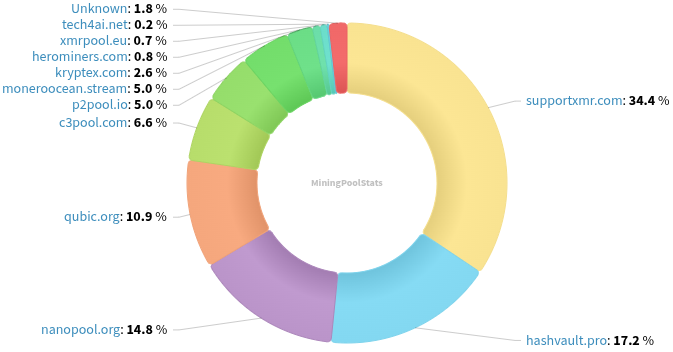
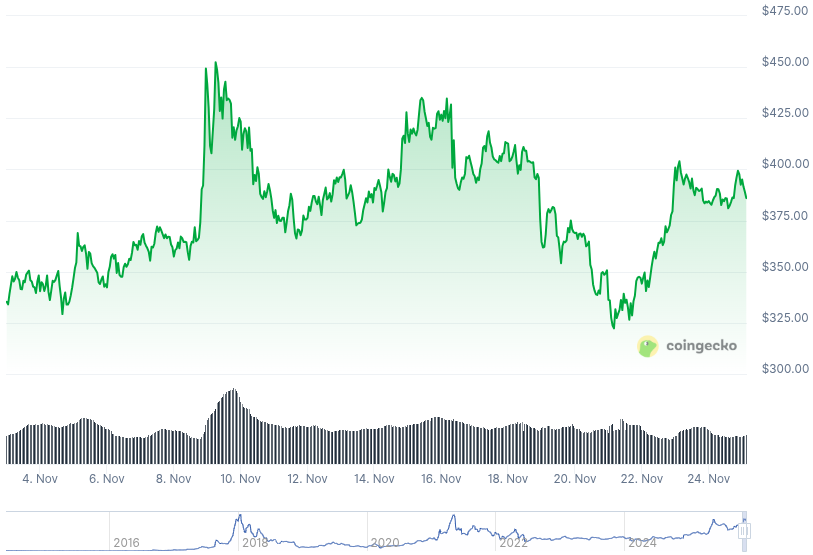

### Table of Contents:

- [Recent News](#news)
- [Upcoming Events](#events)
- [CCS Proposals](#proposals)
- [Price & Blockchain Stats](#stats)
- [Volunteer Opportunities](#volunteer)
- [Support](#support)

### Recent News {#news}

{}
Monero 0.18.4.4 'Fluorine Fermi' Point Release binaries have been released. [CLI](https://www.getmonero.org/2025/11/14/monero-0.18.4.4-released.html); [GUI](https://www.getmonero.org/2025/11/14/monero-0.18.4.4-released.html)). Remember to verify hashes; how-to guides at the bottom of each blog post. As well, you may compile Monero from [source](https://github.com/monero-project/monero#compiling-monero-from-source).
{}

{}
What is the latest on FCMP++, you may ask? FCMP++ wen? Have a read at this X [thread](https://xcancel.com/MoneroResearchL/status/1988993720159445406). Things are moving!
{}

{}
P2Pool [v4.12](https://github.com/SChernykh/p2pool/releases/tag/v4.12) with Tor full support and various Quality-of-Life improvements, bug fixes.
{}

{}
Do you want to run a Monero full node on bare metal, without using Docker? Expatriotic put up a guide to do so. Check it out [here](https://stacker.news/items/1281306).
{}

{}
Remember that little Monero PoS device and repository we shared with you all a couple issues ago? It has rebranded into Monero Merchant, making it easier to propagate the gospel and be more easily recognized by everyone. Introduce Monero Merchant [website](https://moneromerchant.com/). They can set up view only wallets on new server for on-boarded merchants [here](https://register.moneromerchant.com/). Direct `.apk` [download](https://moneromerchant.com/latest.apk). LWS [support](https://github.com/Monero-Merchant/monero-merchant/pull/11) coming up! 3-D printed, LED backlit XMR merchant signs? Sure [thing](https://xcancel.com/monero_merchant/status/1991093686822711465).
{}

{}
Monero node RPC endpoints now have 100% fuzzing coverage! Thanks, MAGIC Grants. Blog [post](https://magicgrants.org/2025/11/17/Monero-RPC-Fuzzing). Privacy Guides [note](https://www.privacyguides.org/news/2025/11/21/monero-node-rpc-codebase-gets-improved-fuzzing-coverage/).
{}

{}
Haveno DEX mobile application by atsamd21 hits [v1.0.0](https://github.com/atsamd21/Haveno-app/releases/tag/v1.0.0) and goes mainnet. As usual, testers and feedback more than welcome!
{}

{}
RetoSwap, previously known as Haveno Reto, happens to be working on their own mobile application as we speak. No pre-release or actual release `.apk` files available yet, but... keep tabs on this [repository](https://github.com/retoaccess1/RetoSwap-App), for future reference.
{}

{}
Did you say... a worldwide, interactive map where you can find XMR/BTC-accepting businesses? That's right! Thanks, Bank Exit peeps. Find it [here](https://bank-exit.org/es/map/3/27.355053897693452/3.1640625).
{}

{}
New LWS wallet in the block? Why not? The more, the merrier, or so they say. Skylight by MAGIC Grants is live. [Announcement](https://magicgrants.org/2025/11/24/Introducing-Skylight-Wallet); Reddit [thread](https://lr.phreedom.club/r/Monero/comments/1p5kqzp/introducing_skylight_wallet_a_modern_monero/).
{}

{}
How to mine Monero guide, by Expatriotic nym, [mine](https://expatriotic.me/mining-monero/) away!
{}

{}
What is the status of XMRBazaar, where are our XMR-centric circular economies going? Aillia shares a bit of that in this blog [post](https://themeritocrat.substack.com/p/monero-circular-economy-from-cypherpunk) of hers under _The Meritocrat_ substack umbrella.
{}

{}
New month? New Monero Monthly by Ungovernable Misfits with Max and Seth for Privacy. Tune into _Run a node_ for Monero Monthly 011. [Audio](https://www.ungovernablemisfits.com/podcast/run-a-node-monero-monthly-11/); [Website](https://www.ungovernablemisfits.com/). [XMRChat](https://xmrchat.com/ugmf).
{}

{}
Monero Talk pushed three (3) new episodes out, with: Vik Sharma from Cake Wallet on a new ATH of downloads, 1M+! John Gotts, on the value of Monero, and Derrick Broze on recent Mexico's protests and what role could MoneroTopia, in-person event, play in all this. Find them all on their [website](https://www.monerotalk.live/episodes) for audio-only version, or any other streaming platform they push their episodes out on.
{}

### Upcoming Events {#events}

{}
Cuprate Workgroup Meeting - [#cuprate](irc://irc.libera.chat/#cuprate) IRC channel; Matrix [room](https://matrix.to/#/#cuprate:monero.social).
{}

{}
Research Lab Meeting - [#monero-research-lab](irc://irc.libera.chat/#monero-research-lab) IRC channel; Matrix [room](https://matrix.to/#/#monero-research-lab:monero.social).
{}

{}
MoneroKon 5 Meeting - [#monerokon](irc://irc.libera.chat/#monerokon) IRC channel; Matrix [room](https://matrix.to/#/#monerokon:matrix.org).
{}

### CCS Proposal Ideas {#proposals}

Below you can find some CCS proposal ideas open for discussion.

{}
39C3 Support
{}

### CCS Proposals Need Funding

{}
Part-time work on Monfluo 2025Q4
{}

{}
Getmonero.org Redesign Implementation
{}

{}
Full-time development 2025Q4
{}

### Price & Blockchain Stats {#stats}

###### Blockchain Stats



###### XMR Blocks Distribution in last 1000 blocks

###### Price & Performance



###### XMR Price Graph

Sources: [miningpoolstats.stream](https://miningpoolstats.stream/monero); [bitinfocharts.com](https://bitinfocharts.com/monero/); [coingecko.com](https://www.coingecko.com/en/coins/monero); [localmonero.co blocks](https://localmonero.co/blocks); [haveno.markets](https://haveno.markets/).


{}
Anyone with moderate technical ability is encouraged to try to build and run Monero nightlies. Do not trust it with your Monero, but feel free to open an Issue on GitHub as problems arise. Instructions to build on your OS of choice can be found [here](https://github.com/monero-project/monero#compiling-monero-from-source). 
{}



