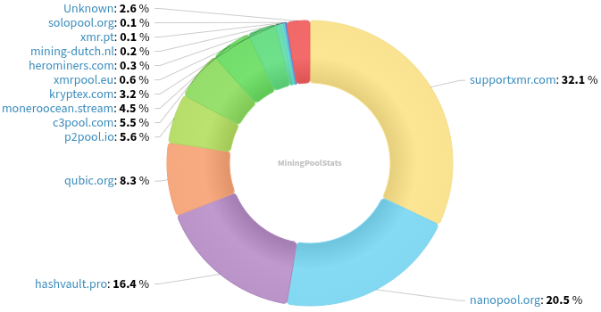
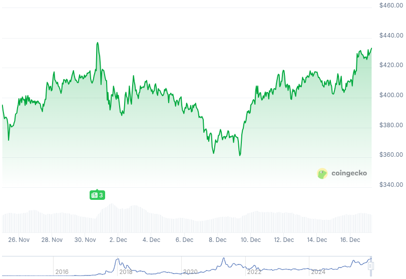

### Table of Contents:

- [Recent News](#news)
- [Upcoming Events](#events)
- [CCS Proposals](#proposals)
- [Price & Blockchain Stats](#stats)
- [Volunteer Opportunities](#volunteer)
- [Support](#support)

### Recent News {#news}

{}
Skylight Wallet [v1.0.3](https://github.com/MAGICGrants/skylight-wallet/releases/tag/v1.0.3) by MAGIC Grants with a few fixes and QoL enhancements.
{}

{}
Monero community member CR1337 launched [monero.jobs](https://monero.jobs/), a job board exlusively for companies/projects who are willed to pay their employees in Monero (XMR). X [thread](https://xcancel.com/CR1337/status/1996795813264322649). Logo by mondetta!
{}

{}
Rucknium: "Spy nodes from the LionLink ASN seem to have completely disappeared a few days ago: [moneronet.info](https://moneronet.info/)."
{}

{}
New papers: Lee, S., & Kim, H. (2025). Inside Qubic's Selfish Mining Campaign on Monero: Evidence, Tactics, and Limits. (https://moneroresearch.info/293) & Venturi, A., Jerico-Yoldi, I., Zola, F., & Orduna, R. (2025). ART: A Graph-based Framework for Investigating Illicit Activity in Monero via Address-Ring-Transaction Structures. (https://moneroresearch.info/292). Rucknium: "It concludes that Qubic did not achieve a 51% attack and Qubic's block-orphaning strategy was usually less profitable than if they had just mined honestly."
{}

{}
DataHoarder put up a new site: https://blocks.p2pool.observer/payments. It will show all public payments during last the last seven (7) days. You can also filter for just CCS now. => CCS [donations](https://blocks.p2pool.observer/payments?id=monero-ccs). Includes the CCS target name and link if available.
{}

{}
Monero community member, lemineurfou, launched a brand-new mining pool. "I just finalized the configuration of a new XMR pool hosted in Europe (to optimize the ping). The objective is to help a bit with decentralization in the face of giants. I’m looking for some cool miners to test the stability with me (0% fee at the moment)." [EuroXMR.eu](http://euroxmr.eu/). To foster new joins, it has added a _hashrate lottery_. The concept: 1 Valid Share = 1 Ticket. Every week, a miner wins a small XMR prize, even if the pool hasn't found a block yet.
{}

{}
MAGIC Monero Fund committee 2026 elections are here! From December 5 through December 31, candidates can run for a seat in it, as well as voters can sign up to be able to vote later in January 2026. All details are found [here](https://magicgrants.org/2025/12/05/Monero-Fund-2026-Election).
{}

{}
Do you remember MAGIC Grants Monero Committee recently ran a fuzzing campaign for Monero's RPC endpoints? They are back! Monero Fuzzing Round 2: Wallet, P2P, and FCMP++ fundraising [campaign](https://donate.magicgrants.org/monero/projects/fuzzing-monero-2).
{}

{}
Monero Community Member WebWipe is hosting yet another meetup, this time along with PubKey in NYC. PubKey Holiday Privacy pop-up will take place this Friday, December 19th. All details are to be found [here](https://luma.com/zoc6lubi).
{}

{}
Kuno fundraising campaign for Revuo Monero Maintenance (2026 Q1) is live! If you get value out of Revuo and wish to see it continue, please consider spreading the word, if you can't chip in. Kuno fundraising [campaign](https://kuno.anne.media/fundraiser/mytv/). X [thread](https://xcancel.com/revuoxmr/status/1997446390096785602).
{}

{}
New month? New Monero Monthly by Ungovernable Misfits with Max and Seth for Privacy. Tune into _Most used, least perused_ for Monero Monthly 011. [Audio](https://www.ungovernablemisfits.com/podcast/most-used-least-perused-monero-monthly-12/); [Website](https://www.ungovernablemisfits.com/). [XMRChat](https://xmrchat.com/ugmf).
{}

{}
Monero Talk pushed three (3) new episodes out, with: Joel Valenzuela with what's next for privacy season. Paul Puey from Edge Wallet, on private payments, and David Burkett on Litecoin as a privacy coin thanks to MWEB. Find them all on their [website](https://www.monerotalk.live/episodes) for audio-only version, or any other streaming platform they push their episodes out on.
{}

### Upcoming Events {#events}

{}
Research Lab Meeting - [#monero-research-lab](irc://irc.libera.chat/#monero-research-lab) IRC channel; Matrix [room](https://matrix.to/#/#monero-research-lab:monero.social).
{}

{}
Community Workgroup Meeting - [#monero-community](irc://irc.libera.chat/#monero-community) IRC channel; Matrix [room](https://matrix.to/#/#monero-community:monero.social).
{}

{}
Monero Tech Meeting - [#no-wallet-left-behind](irc://irc.libera.chat/#no-wallet-left-behind) IRC channel; Matrix [room](https://matrix.to/#/#no-wallet-left-behind:monero.social).
{}

{}
Cuprate Workgroup Meeting - [#cuprate](irc://irc.libera.chat/#cuprate) IRC channel; Matrix [room](https://matrix.to/#/#cuprate:monero.social).
{}

### CCS Proposal Ideas {#proposals}

Below you can find some CCS proposal ideas open for discussion.

{}
39C3 Support
{}

### CCS Proposals Need Funding

{}
Getmonero.org Redesign Implementation
{}

{}
Full-time 2025 Q4
{}

{}
Research Bulletproofs*
{}

### Price & Blockchain Stats {#stats}

###### Blockchain Stats



###### XMR Blocks Distribution in last 1000 blocks

###### Price & Performance



###### XMR Price Graph

Sources: [miningpoolstats.stream](https://miningpoolstats.stream/monero); [bitinfocharts.com](https://bitinfocharts.com/monero/); [coingecko.com](https://www.coingecko.com/en/coins/monero); [localmonero.co blocks](https://localmonero.co/blocks); [haveno.markets](https://haveno.markets/).


{}
Anyone with moderate technical ability is encouraged to try to build and run Monero nightlies. Do not trust it with your Monero, but feel free to open an Issue on GitHub as problems arise. Instructions to build on your OS of choice can be found [here](https://github.com/monero-project/monero#compiling-monero-from-source). 
{}



