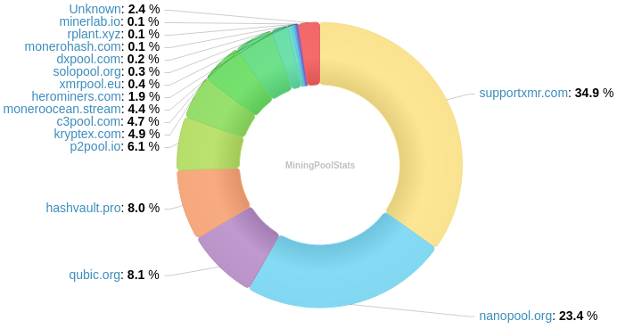
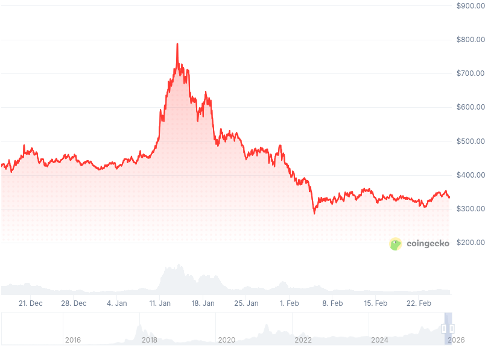

### Table of Contents:

- [Recent News](#news)
- [Upcoming Events](#events)
- [CCS Proposals](#proposals)
- [Price & Blockchain Stats](#stats)
- [Volunteer Opportunities](#volunteer)
- [Support](#support)

### Recent News {#news}

{}
Monero v0.18.4.5 'Fluorine Fermi' Point Release binaries have been released. [CLI](https://www.getmonero.org/2026/01/11/monero-0.18.4.5-released.html); [GUI](https://www.getmonero.org/2026/01/11/monero-GUI-0.18.4.5-released.html). Remember to verify hashes; how-to guides at the bottom of each blog post. As well, you may compile Monero from [source](https://github.com/monero-project/monero#compiling-monero-from-source).
{}

{}
Monfluo Wallet [v0.9.4](https://codeberg.org/acx/monfluo/releases/tag/0.9.4) running Monero v0.18.4.5.
{}

{}
P2Pool [v4.13](https://github.com/SChernykh/p2pool/releases/tag/v4.13).
{}

{}
Haveno App [v1.0.2](https://github.com/atsamd21/Haveno-app/releases/tag/v1.0.2) running Haveno DEX v1.0.2 (Android). Reddit [thread](https://redlib.federated.nexus/r/Monero/comments/1pml8kr/haveno_for_android_released/).
{}

{}
RetoSwap App [v1.0.2.1](https://github.com/retoaccess1/RetoSwap-App/releases/tag/v1.0.2.1-reto) (Android) running Haveno Reto [v1.2.3](https://github.com/retoaccess1/haveno-reto/releases/tag/1.2.3-reto).
{}

{}
Is Monero less quantum resistant than Bitcoin these days? According to this post in Stacker [News](https://stacker.news/items/1356557) it might be. Let's review what _jeffro256_ from MRL proposes with [Post-quantum Turnstile Design for Carrot/FCMP++ Enotes](https://gist.github.com/jeffro256/146bfd5306ea3a8a2a0ea4d660cd2243).
{}

{}
Monero Multisig GUI [v0.1.3](https://github.com/freigeist-m/monero-multisig-gui/releases/tag/v0.1.3). Reddit [thread](https://redlib.federated.nexus/r/Monero/comments/1q6ex34/new_release_monero_multisig_gui_v013/).
{}

{}
New year? New Monerujo, or should we say... Moneroju? Work-in-progress by gunthermakers; they decided to say goodbye to everything from the past and start from scratch. More? [soon.monerujo.app](https://soon.monerujo.app/); Reddit [thread](https://redlib.federated.nexus/r/Monerujo/comments/1r267a8/monerujo2_preview_test_experimental_build_is_out/). It has a thing for merchants, looks [interesting](https://xcancel.com/monerujowallet/status/2024200959325241642).
{}

{}
Cake Wallet [v6.0.0](https://github.com/cake-tech/cake_wallet/releases/tag/v6.0.0) (Beta) with brand-new UI/UX and Bitcoin Lightning support, along with several quality-of-life improvements and bug fixes. F-Droid [repository](https://fdroid.cakelabs.com/); [Forum](https://forum.cakewallet.com/).
{}

{}
The well-known Free Software Foundation received two major contributions totaling around **$900,000 USD**, both made to the foundation in the cryptocurrency Monero! Read more [here](https://www.fsf.org/news/free-software-foundation-receives-historic-private-donations). Donors preferred to remain anonymous. ;)
{}

{}
Remember MoneroKon in Prague last year? The whole archive is up. Playlist on YouTube is up-to-date with all edited videos. Find it [here](https://www.monerokon.org/past_events/2025.html).
{}

{}
There is a new version of the MRL ban list. The spy nodes changed their IP addresses. Raw list [file](https://raw.githubusercontent.com/Boog900/monero-ban-list/refs/heads/main/ban_list.txt); Reddit [thread](https://redlib.federated.nexus/r/Monero/comments/1qct02j/run_your_node_with_the_new_mrl_spy_node_ban_list/). If you use Docker to run your Monero remote node, Seth for Privacy's docker [repository](https://github.com/sethforprivacy/simple-monerod-docker) works with the new ban list.
{}

{}
Skylight Wallet [v1.0.8](https://github.com/MAGICGrants/skylight-wallet/releases/tag/v1.0.8). Available on iOS [now](https://apps.apple.com/us/app/skylight-wallet-for-monero/id6759176050) as well. Reddit [thread](https://redlib.federated.nexus/r/Monero/comments/1rdhons/skylight_wallet_for_monero_an_opensource/).
{}

{}
MAGIC Monero Fund Elections results are out! Check [them](https://magicgrants.org/2026/01/23/Monero-Fund-2026-Election-Results) out.
{}

{}
New Monero report from TRM Labs. _Monero in 2025: Persistent Use and Emerging Network-Layer Insights_ [here](https://www.trmlabs.com/resources/blog/monero-in-2025-persistent-use-and-emerging-network-layer-insights).
{}

{}
ProbeLabs published a deep dive into the Monero network topology. Peep it [here](https://probelab.io/blog/peering-into-privacy-a-deep-dive-into-the-monero-network-topology/). X [thread](https://xcancel.com/MagicGrants/status/2027055968056430669) by MAGIC Grants.
{}

{}
MoneroKon 2026 announcement, by OrangeFren. Reddit [thread](https://redlib.federated.nexus/r/Monero/comments/1qcvs90/monerokon_2026_announcement/). Konferenco 6 will take place June 5-7th in Warsaw, Poland.
{}

{}
New month? New Monero Monthly by Ungovernable Misfits with Max, Seth for Privacy, and... Riccardo Spagni. Tune into _No price, just privacy_ for Monero Monthly 013. [Audio](https://www.ungovernablemisfits.com/podcast/no-price-just-privacy-monero-monthly-13-riccardo-spagni/); [Website](https://www.ungovernablemisfits.com/). [XMRChat](https://xmrchat.com/ugmf).
{}

{}
Monero Talk took a break while they put together MoneroTopia down in Mexico city. Expect the talks videos to be uploaded to YouTube and the likes in the near future, to catch up! Follow along over at [monerotopia.com](https://monerotopia.com/).
{}

### Upcoming Events {#events}

{}
Monero Tech Meeting - [#no-wallet-left-behind](irc://irc.libera.chat/#no-wallet-left-behind) IRC channel; Matrix [room](https://matrix.to/#/#no-wallet-left-behind:monero.social).
{}

{}
Cuprate Workgroup Meeting - [#cuprate](irc://irc.libera.chat/#cuprate) IRC channel; Matrix [room](https://matrix.to/#/#cuprate:monero.social).
{}

{}
Research Lab Meeting - [#monero-research-lab](irc://irc.libera.chat/#monero-research-lab) IRC channel; Matrix [room](https://matrix.to/#/#monero-research-lab:monero.social).
{}

### CCS Proposal Ideas {#proposals}

Below you can find some CCS proposal ideas open for discussion.

{}
Site and CCS UI/UX, Transitions & Animations work (4 months)
{}

{}
Integrate FCMP++ into monero-inflation-checker
{}

{}
Full-time 2026Q1
{}

### CCS Proposals Need Funding

{}

### Price & Blockchain Stats {#stats}

###### Blockchain Stats



###### XMR Blocks Distribution in last 1000 blocks

###### Price & Performance



###### XMR Price Graph

Sources: [miningpoolstats.stream](https://miningpoolstats.stream/monero); [bitinfocharts.com](https://bitinfocharts.com/monero/); [coingecko.com](https://www.coingecko.com/en/coins/monero); [localmonero.co blocks](https://localmonero.co/blocks); [haveno.markets](https://haveno.markets/).


{}
Anyone with moderate technical ability is encouraged to try to build and run Monero nightlies. Do not trust it with your Monero, but feel free to open an Issue on GitHub as problems arise. Instructions to build on your OS of choice can be found [here](https://github.com/monero-project/monero#compiling-monero-from-source). 
{}



