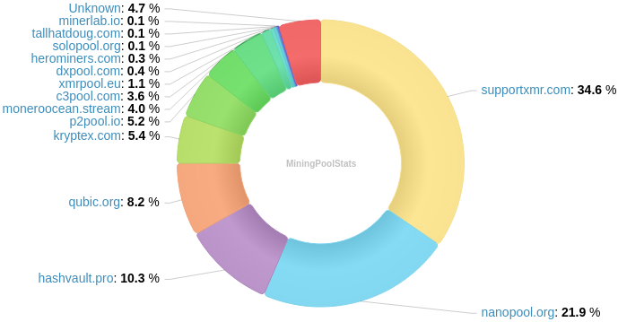
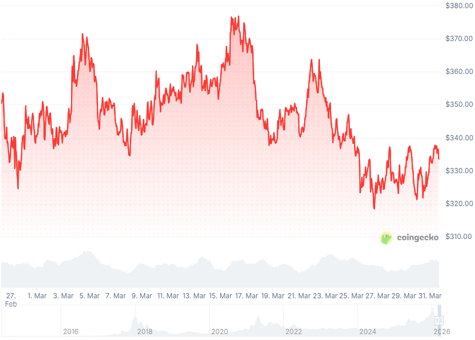

### Table of Contents:

- [Recent News](#news)
- [Upcoming Events](#events)
- [CCS Proposals](#proposals)
- [Price & Blockchain Stats](#stats)
- [Volunteer Opportunities](#volunteer)
- [Support](#support)

### Recent News {#news}

{}
Monero v0.18.4.6 'Fluorine Fermi' Point Release binaries have been released. [CLI](https://www.getmonero.org/2026/03/04/monero-0.18.4.6-released.html); Monero v0.18.4.7 [GUI](https://www.getmonero.org/2026/03/04/monero-GUI-0.18.4.7-released.html). Remember to verify hashes; how-to guides at the bottom of each blog post. As well, you may compile Monero from [source](https://github.com/monero-project/monero#compiling-monero-from-source).
{}

{}
Monfluo Wallet [v0.9.5](https://codeberg.org/acx/monfluo/releases/tag/0.9.4) running Monero v0.18.4.6; implementing address book; and transaction notes, among other bug fixes. Monfluo Oxide might be on the orizon, moving away from _wallet2_ and using Rust libraries instead. [Branch](https://codeberg.org/Monfluo/monfluo-android/src/branch/oxide); Experimental [builds](https://codeberg.org/Monfluo/monfluo-android/actions/runs/247/jobs/0/attempt/1).
{}

{}
RetoSwap App [v1.0.2.1](https://github.com/retoaccess1/RetoSwap-App/releases/tag/v1.0.2.1-reto) (Android) running Haveno Reto [v1.2.3.1](https://github.com/retoaccess1/haveno-reto/releases/tag/1.2.3.1-reto) with a lot of bug fixes and quality-of-life improvements.
{}

{}
P2Pool [v4.14](https://github.com/SChernykh/p2pool/releases/tag/v4.14).
{}

{}
rbrunner7 published a brief breakdown of different Polyseed variants across the ecosystem, supposedly Cake Wallet is the one that supports most if not all scenarios. Take a [peek](https://github.com/tevador/polyseed/issues/13#issuecomment-3980281619).
{}

{}
XMR PoS Android application has a new UI redesign pull [request](https://github.com/Monero-Merchant/monero-merchant/pull/5) fixing old issues. If anyone knows how to build `.apk` files from sources, testers [welcome](https://matrix.to/#/!WzzKmkfUkXPHFERgvm:matrix.org/$tY7Za2kBRWlF9N3UQyMB9U1IZbUQkt5sfdk4pgT5YpA?via=matrix.org&via=monero.social&via=libera.chat).
{}

{}
Eigenwallet [v4.2.3](https://github.com/eigenwallet/core/releases/tag/4.2.3). [Changelog](https://eigenwallet.org/changelog/).
{}

{}
What's better than RandomX? RandomX [v2.0](https://github.com/tevador/RandomX/releases/tag/v2.0) by tevador. Peek some of the changes in there!
{}

{}
Remember MoneroKon in Prague last year? The whole archive **list** is up. Playlist on YouTube is now up-to-date and available with all edited videos. Find the list [here](https://www.monerokon.org/past_events/2025.html). YouTube [playlist](https://invidious-1.privadency.com/playlist?list=PLsSYUeVwrHBlZQl6YKwK_mCBmOxkZv1zn). Thanks to vostoemisio for the upload!
{}

{}
Soul Reaver shared a blog post talking about their experience using Skylight Wallet and why others should look into it. Have a [read](https://soulreaver.substack.com/p/skylight-monero-wallet-magic-grants).
{}

{}
**Community Project Highlights**: Monero SuperPay for Umbrel; Monero Superbrain. GitHub [repository](https://github.com/brainchainz/Monero-Superbrain); X [thread](https://xcancel.com/MgkMshrmBrkfst/status/2031959045847024053). [kyc.rip](https://kyc.rip/): like trocador, with a more 1337 h4xx0r UI/UX (?); [xmr.bio](https://xmr.bio/): associate a XMR address to your X handle; and [stables.rip](https://stables.rip/), because they are truly uncensorable! Shout out to [CyberSatoshi](https://xcancel.com/XBToshi).
{}

{}
New month? New Monero Monthly by Ungovernable Misfits with Max and Seth for Privacy. Tune into _Monthly-ish..._ for Monero Monthly 014. [Audio](https://www.ungovernablemisfits.com/podcast/monero-monthly-ish/); [Website](https://www.ungovernablemisfits.com/). [XMRChat](https://xmrchat.com/ugmf).
{}

{}
Monero Talk had a conversation with MoneroTopia 2026 speaker: ex-Paxful and No Ones Ray Youssef, following his arrest after his presentation in Mexico. Sounds interesting, no? [Video](https://invidious-1.privadency.com/watch?v=9ZlHSCNn9lg); [Audio](https://www.monerotalk.live/monerotalk-378).
{}

### Upcoming Events {#events}

{}
Community Workgroup Meeting - [#monero-community](irc://irc.libera.chat/#monero-community) IRC channel; Matrix [room](https://matrix.to/#/#monero-community:monero.social).
{}

{}
Monero Tech Meeting - [#no-wallet-left-behind](irc://irc.libera.chat/#no-wallet-left-behind) IRC channel; Matrix [room](https://matrix.to/#/#no-wallet-left-behind:monero.social).
{}

{}
Cuprate Workgroup Meeting - [#cuprate](irc://irc.libera.chat/#cuprate) IRC channel; Matrix [room](https://matrix.to/#/#cuprate:monero.social).
{}

{}
Research Lab Meeting - [#monero-research-lab](irc://irc.libera.chat/#monero-research-lab) IRC channel; Matrix [room](https://matrix.to/#/#monero-research-lab:monero.social).
{}

### CCS Proposal Ideas {#proposals}

Below you can find some CCS proposal ideas open for discussion.

{}
Grease Payment Channels -- production implementation and SDK
{}

{}
I2P SAMv3 support
{}

{}
2026 Q2 Proposal
{}

### CCS Proposals Need Funding

{}
Full-time work (3 months)
{}

{}
Full-time development 2026Q1
{}

{}
Cuprate RPC for wallet support (Rust Monero node).
{}

### Price & Blockchain Stats {#stats}

###### Blockchain Stats



###### XMR Blocks Distribution in last 1000 blocks

###### Price & Performance



###### XMR Price Graph

Sources: [miningpoolstats.stream](https://miningpoolstats.stream/monero); [bitinfocharts.com](https://bitinfocharts.com/monero/); [coingecko.com](https://www.coingecko.com/en/coins/monero); [localmonero.co blocks](https://localmonero.co/blocks); [haveno.markets](https://haveno.markets/).


{}
Anyone with moderate technical ability is encouraged to try to build and run Monero nightlies. Do not trust it with your Monero, but feel free to open an Issue on GitHub as problems arise. Instructions to build on your OS of choice can be found [here](https://github.com/monero-project/monero#compiling-monero-from-source). 
{}



