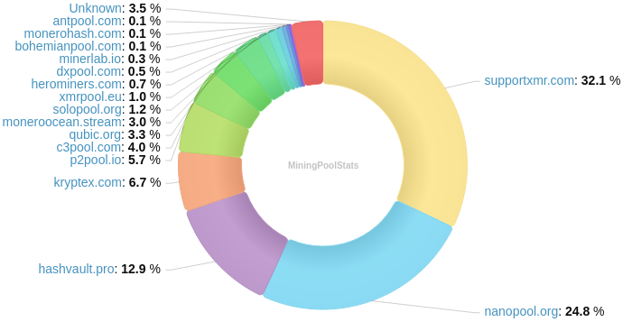
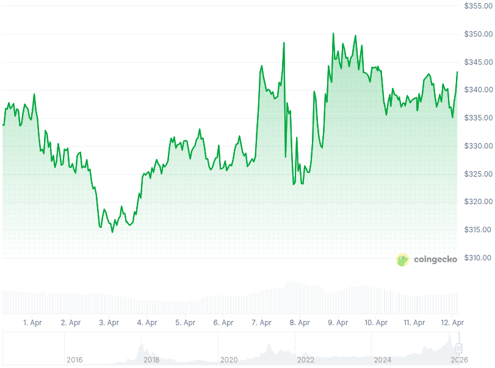

### Table of Contents:

- [Recent News](#news)
- [Upcoming Events](#events)
- [CCS Proposals](#proposals)
- [Price & Blockchain Stats](#stats)
- [Volunteer Opportunities](#volunteer)
- [Support](#support)

### Recent News {#news}

{}
Eigenwallet [v4.3.1](https://github.com/eigenwallet/core/releases/tag/4.3.1). [Changelog](https://eigenwallet.org/changelog/).
{}

{}
Monero Community Member WebWipe is hosting yet another privacy meetup, this time during Consensus Miami. Consensus Miami Privacy pop-up will take place on Tuesday, May 5th. All details are to be found [here](https://luma.com/lfkxewa4). _Happy Cinco de Mayo!_ ;-)
{}

{}
**PSA:** Revuo Monero will be maintained on **"as best as possible"** frequency until Kuno [Fundraiser](https://kuno.anne.media/fundraiser/mytv/) gets fully funded. When that happens, it'll kick off three (3) full months of *weekly* maintenance, as laid out in the description. Do you want us back in full? Chip in. Otherwise, well, catch you _when_ possible! X [thread](https://xcancel.com/revuoxmr/status/2039390061695762512).
{}

{}
**[!!]** *New service, tread with caution!* We've got Monerica, but what about [Monero Index](https://moneroindex.com/): new XMR directory site, _always free_, per their own description. The UI/UX looks slick! What about [moneromarketcap.com](https://moneromarketcap.com/)? Another good-looking website, let's explore and use accordingly!
{}

{}
**Community Project Highlights**: Monero invoices in seconds; no accounts, no KYC, no back-end. Open source? Yes. Onion? Gourmet much? Yes. Take it away with [xmrpay.link](https://xmrpay.link/); GitHub [repository](https://github.com/schmidt1024/xmrpay); [Schmidt](https://nostr.at/nevent1qqs8ruumxmzutnqmqq6j3npg80wnj7hxskl4xq0gygt046juxsjc9cqpr4mhxue69uhkummnw3ez6ur4vgh8wetvd3hhyer9wghxuet5qgsq6l8v48sqpec3uf3mc99zy94twjtg485s86azzjn3gvq2mm095gq9lzrg3). Imagine getting paid in XMR for what you know how to do well, or are passionate about. Introduce [monero.jobs](https://monero.jobs/): list your service or produce, get paid. Between you and the other. Reviews & ratings, much fungible. Let CR1337 tell you [more](https://xcancel.com/CR1337/status/2037122949099168144) about it!
{}

{}
**Community Project Highlights**: Monero SuperPay, Monero SuperBrain... they've got a flashy brand-new website and MacOS downloads available now! Have a peek over at [monerosuperpay.com](https://monerosuperpay.com/); X [thread](https://xcancel.com/MgkMshrmBrkfst/status/2042541020689371197).
{}

{}
Monero Talk had a conversation with Diego "rehrar" Salazar from CypherStack, to share all the last updates with FCMP++; nuances around privacy; and more! _Wen FCMP++ on mainnet ser!?_ Caught your attention? => [Video](https://invidious-1.privadency.com/watch?v=uNaWlU8tCK8); [Audio](https://www.monerotalk.live/monerotalk-379).
{}

### Upcoming Events {#events}

{}
Monero Tech Meeting - [#no-wallet-left-behind](irc://irc.libera.chat/#no-wallet-left-behind) IRC channel; Matrix [room](https://matrix.to/#/#no-wallet-left-behind:monero.social).
{}

{}
Cuprate Workgroup Meeting - [#cuprate](irc://irc.libera.chat/#cuprate) IRC channel; Matrix [room](https://matrix.to/#/#cuprate:monero.social).
{}

{}
Research Lab Meeting - [#monero-research-lab](irc://irc.libera.chat/#monero-research-lab) IRC channel; Matrix [room](https://matrix.to/#/#monero-research-lab:monero.social).
{}

### CCS Proposal Ideas {#proposals}

Below you can find some CCS proposal ideas open for discussion.

{}
FCMP++ Integration Audit
{}

{}
Acx part-time work on Monfluo 2026Q2
{}

{}
Monero.eco 2025-2026 compensation
{}

### CCS Proposals Need Funding

{}
Full-time development 2026Q1
{}

{}
Cuprate RPC for wallet support (Rust Monero node)
{}

{}
CCS Coordinator + QATS
{}

### Price & Blockchain Stats {#stats}

###### Blockchain Stats



###### XMR Blocks Distribution in last 1000 blocks

###### Price & Performance



###### XMR Price Graph

Sources: [miningpoolstats.stream](https://miningpoolstats.stream/monero); [bitinfocharts.com](https://bitinfocharts.com/monero/); [coingecko.com](https://www.coingecko.com/en/coins/monero); [localmonero.co blocks](https://localmonero.co/blocks); [haveno.markets](https://haveno.markets/).


{}
Anyone with moderate technical ability is encouraged to try to build and run Monero nightlies. Do not trust it with your Monero, but feel free to open an Issue on GitHub as problems arise. Instructions to build on your OS of choice can be found [here](https://github.com/monero-project/monero#compiling-monero-from-source). 
{}



