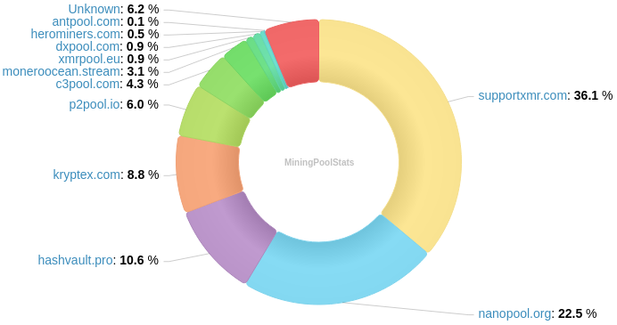
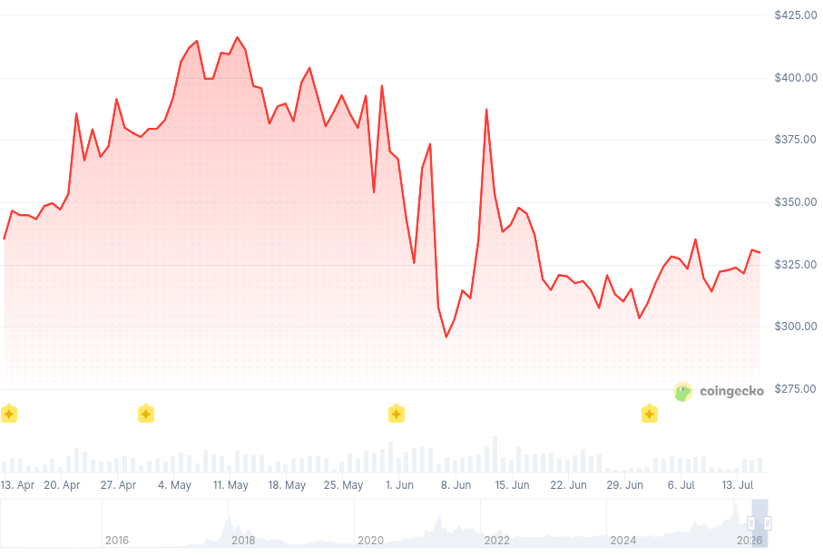

### Table of Contents:

- [Recent News](#news)
- [Upcoming Events](#events)
- [CCS Proposals](#proposals)
- [Price & Blockchain Stats](#stats)
- [Volunteer Opportunities](#volunteer)
- [Support](#support)

### Recent News {#news}

{}
Monero v0.18.5.1 'Fluorine Fermi' Point Release binaries have been released. [CLI](https://www.getmonero.org/2026/07/08/monero-0.18.5.1-released.html); [GUI](https://www.getmonero.org/2026/07/08/monero-GUI-0.18.5.1-released.html). Remember to verify hashes; how-to guides at the bottom of each blog post. As well, you may compile Monero from [source](https://github.com/monero-project/monero#compiling-monero-from-source). X [thread](https://xcancel.com/monero/status/2076740491719155783).
{}

{}
Serai DEX keeps progressing steadily. Their node implementation received a security audit back in April. Blog [post](https://serai.exchange/2026/04/15/serai-blockchain-audited.html); X [thread](https://xcancel.com/SeraiDEX/status/2044416943952699602).
{}

{}
Monero Merchant [v2.1](https://github.com/Monero-Merchant/monero-merchant/releases/tag/v2.1) was released, including: Light Wallet Support; new icons; new UI; and more. New [dashboard](https://github.com/Monero-Merchant/monero-merchant/tree/main/backend#vendor-dashboard) too! Oh, yeah, Umbrel [support](https://github.com/Monero-Merchant/monero-merchant/tree/main/umbrel) was added as well. X [thread](https://nitter.privacyredirect.com/monero_merchant/status/2047278364143075545); Umbrel support X [thread](https://nitter.privacyredirect.com/monero_merchant/status/2069640985798176772).
{}

{}
FCMP++ beta v2.1 on the horizon. X [thread](https://xcancel.com/MoneroResearchL/status/2077735320536199421).
{}

{}
GitHub nym b4n6-b4n6 published a Monero DEX orderbook [repository](https://github.com/b4n6-b4n6/xmr-dex-orderbooks-5) on GitHub. Go find out what it is and what it does over at [monero-orderbooks.com](https://monero-orderbooks.com/).
{}

{}
GitHub nym n0 published a _mempool_ Monero fork: MoneroSpace, a Monero block explorer and mempool visualizer based on mempool.space. GitHub [repository](https://github.com/n0/monerospace-org); [monerospace.org](https://monerospace.org/).
{}

{}
BasicSwap DEX was exploited. "Losses of 0.66 BTC ($42k) confirmed so far," according to OrangeFren on [X](https://xcancel.com/OrangeFren/status/2077073054283284609). Fret not! BasicSwap DEX [v0.17.2](https://blog.basicswapdex.com/basicswap-release-v017_2/) was released. Find all the details in their own blog post.
{}

{}
Looks like Kraken is introducing Monero deposit and withdrawal limits in a prelude to a full-out delisting. Deposit: 10.8 XMR per month; Withdraw: 4.6 XMR per month. X [thread](https://xcancel.com/xenumonero/status/2076807666731520248); X [thread](https://xcancel.com/ctcheeto/status/2076695423474143292).
{}

{}
Gingeropolous completed the first milestone of their CCS [proposal](https://ccs.getmonero.org/proposals/gingeropolous-netsim.html): Monero Network Simulation Tool. Meet Monerosim [v0.2.0](https://github.com/Fountain5405/monerosim/releases/tag/v0.2.0). GitHub [repository](https://github.com/Fountain5405/monerosim). Feedback appreciated.
{}

{}
Skylight [Wallet](https://skylight.magicgrants.org/) soon to be available on [F-Droid](https://gitlab.com/fdroid/fdroiddata/-/merge_requests/37027)!
{}

{}
All MoneroKon 5 talks have been uploaded and are available in the Monero Community Workgroup YouTube channel. Direct [playlist](https://invidious-1.privadency.com/playlist?list=PLsSYUeVwrHBmzJAlb0yyCS7CgaHC1ut4j); YouTube [link](https://www.youtube.com/playlist?list=PLsSYUeVwrHBmzJAlb0yyCS7CgaHC1ut4j).
{}

{}
**[!!]** *New service, tread with caution!* XMRMatters: peer-to-peer exchange platform, with escrow and all that jazz. Monero.forum [thread](https://monero.forum/thread/platform-xmrmatters-p2p-exchange-15-days-mainnet-architecture-overview); registration is open over at [xmrmatters.space](https://xmrmatters.space/)!
{}

{}
**Community Project Highlights**: Monero Hub: the Hub of all things Monero (XMR). Swapping, Directory, Blog, Shop, Memes, Community, Learning & More - [XMRHub.org](https://xmrhub.org/). Monero Map: find local Monero-accepting businesses | XMR stickers in the wild | People to buy & sell XMR from, locally - [XMRMap.org](https://xmrmap.org/).
{}

{}
**Community Project Highlights**: Monero SuperPay, Monero SuperBrain... they've got a flashy, dank Matrix update. You can upgrade via Umbrel if you wish. Have a peek: X [thread](https://xcancel.com/MgkMshrmBrkfst/status/2073580864932548952).
{}

{}
Revuo Monero will be maintained on "as best as possible"... _kidding_! Revuo Monero is back in full: for 3 months, or 12 issues (however long the 12 issues take, but ideally, 3 months) we will be with you. Fundraiser reached its set [goal](https://kuno.anne.media/fundraiser/mytv/), and what is promised, is debt. ;-) X [thread](https://nitter.privacyredirect.com/revuo_xmr/status/2076360636607451605).
{}

{}
Monero Talk had a conversation with DHC; Christopher Cialone; and John Woods. Find them all over at [monerotalk.live](https://www.monerotalk.live/). YouTube [channel](https://www.youtube.com/@MoneroTalk).
{}

### Upcoming Events {#events}

{}
Monero Tech Meeting - [#no-wallet-left-behind](irc://irc.libera.chat/#no-wallet-left-behind) IRC channel; Matrix [room](https://matrix.to/#/#no-wallet-left-behind:monero.social).
{}

{}
Cuprate Workgroup Meeting - [#cuprate](irc://irc.libera.chat/#cuprate) IRC channel; Matrix [room](https://matrix.to/#/#cuprate:monero.social).
{}

{}
Research Lab Meeting - [#monero-research-lab](irc://irc.libera.chat/#monero-research-lab) IRC channel; Matrix [room](https://matrix.to/#/#monero-research-lab:monero.social).
{}

### CCS Proposal Ideas {#proposals}

Below you can find some CCS proposal ideas open for discussion.

{}
ANONERO Continued Development (1 year)
{}

{}
full-time development 2026Q2
{}

{}
Monero Konferenco 2026 voice-over and working on xmr.ru 
{}

### CCS Proposals Need Funding

{}
CCS Frontend Redesign
{}

{}
Cuprate Address Book, Reproducible Build and Supply Chain Security (3 months)
{}

{}
Research and Development 1
{}

### Price & Blockchain Stats {#stats}

###### Blockchain Stats



###### XMR Blocks Distribution in last 1000 blocks

###### Price & Performance



###### XMR Price Graph

Sources: [miningpoolstats.stream](https://miningpoolstats.stream/monero); [bitinfocharts.com](https://bitinfocharts.com/monero/); [coingecko.com](https://www.coingecko.com/en/coins/monero); [localmonero.co blocks](https://localmonero.co/blocks); [haveno.markets](https://haveno.markets/).


{}
Anyone with moderate technical ability is encouraged to try to build and run Monero nightlies. Do not trust it with your Monero, but feel free to open an Issue on GitHub as problems arise. Instructions to build on your OS of choice can be found [here](https://github.com/monero-project/monero#compiling-monero-from-source). 
{}



